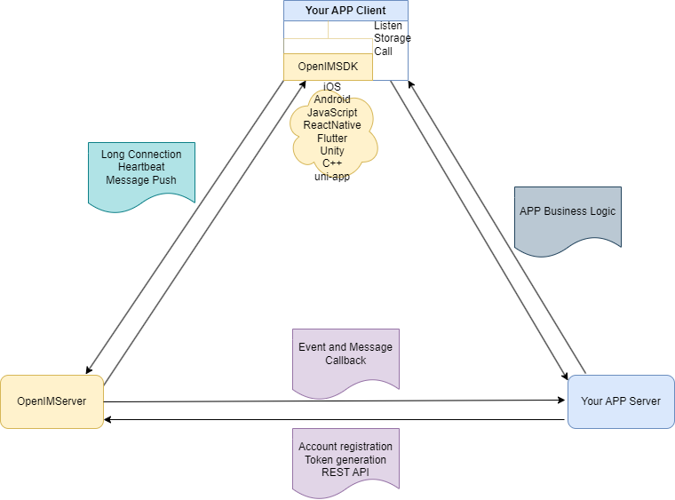
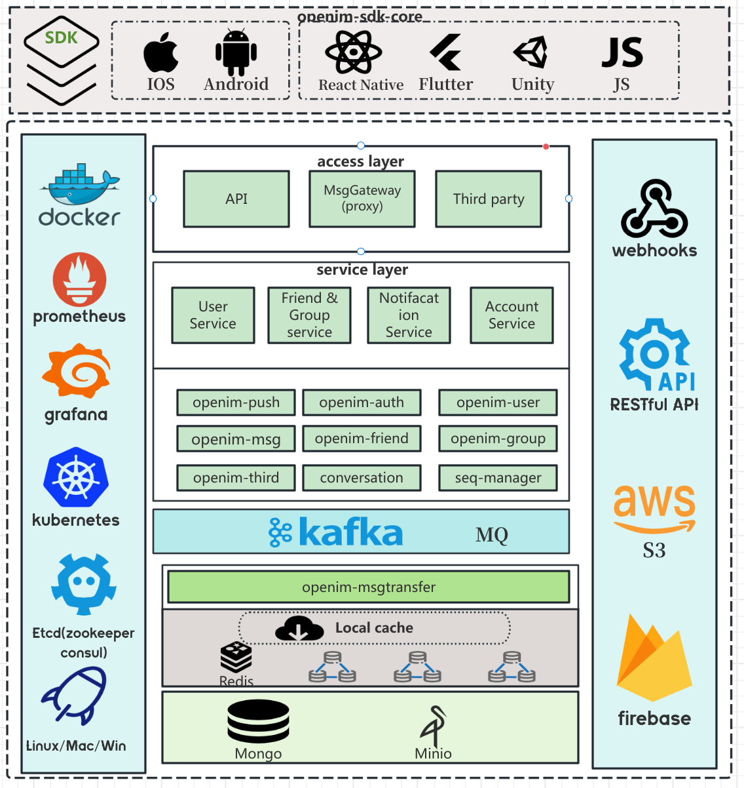

    

  <a href="../../README.md">Englist</a> · 
  <a href="../../README_zh_CN.md">中文</a> · 
  <a href="./README_uk.md ">Українська</a> · 
  <a href="./README_cs.md">Česky</a> · 
  <a href="./README_hu.md">Magyar</a> · 
  <a href="./README_es.md">Español</a> · 
  <a href="./README_fa.md">فارسی</a> · 
  <a href="./README_fr.md">Français</a> · 
  <a href="./README_de.md">Deutsch</a> · 
  <a href="./README_pl.md">Polski</a> · 
  <a href="./README_id.md">Indonesian</a> · 
  <a href="./README_fi.md">Suomi</a> · 
  <a href="./README_ml.md">മലയാളം</a> · 
  <a href="./README_ja.md">日本語</a> · 
  <a href="./README_nl.md">Nederlands</a> · 
  <a href="./README_it.md">Italiano</a> · 
  <a href="./README_ru.md">Русский</a> · 
  <a href="./README_pt_BR.md">Português (Brasil)</a> · 
  <a href="./README_eo.md">Esperanto</a> · 
  <a href="./README_ko.md">한국어</a> · 
  <a href="./README_ar.md">العربي</a> · 
  <a href="./README_vi.md">Tiếng Việt</a> · 
  <a href="./README_da.md">Dansk</a> · 
  <a href="./README_el.md">Ελληνικά</a> · 
  <a href="./README_tr.md">Türkçe</a>

## Ⓜ️ Về OpenIM

OpenIM là một nền tảng dịch vụ được thiết kế đặc biệt cho việc tích hợp chat, cuộc gọi âm thanh-video, thông báo và chatbot AI vào các ứng dụng. Nó cung cấp một loạt các API mạnh mẽ và Webhooks, giúp các nhà phát triển dễ dàng tích hợp các tính năng tương tác này vào ứng dụng của mình. OpenIM không phải là một ứng dụng chat độc lập, mà là một nền tảng hỗ trợ các ứng dụng khác để đạt được các chức năng giao tiếp phong phú. Sơ đồ sau đây minh họa sự tương tác giữa AppServer, AppClient, OpenIMServer và OpenIMSDK để giải thích chi tiết.

## 🚀 Về OpenIMSDK

**OpenIMSDK** là một SDK IM được thiết kế cho **OpenIMServer**, được tạo ra đặc biệt để nhúng vào các ứng dụng khách. Các tính năng chính và các mô-đun của nó như sau:

+ 🌟 Các Tính Năng Chính:

  - 📦 Lưu trữ cục bộ
  - 🔔 Gọi lại sự kiện (Listener callbacks)
  - 🛡️ Bọc API
  - 🌐 Quản lý kết nối

+ 📚 Các Mô-đun Chính:

  1. 🚀 Khởi tạo và Đăng nhập
  2. 👤 Quản lý Người dùng
  3. 👫 Quản lý Bạn bè
  4. 🤖 Chức năng Nhóm
  5. 💬 Xử lý Cuộc trò chuyện

Nó được xây dựng bằng Golang và hỗ trợ triển khai đa nền tảng, đảm bảo trải nghiệm truy cập nhất quán trên tất cả các nền tảng

👉 **[Khám phá GO SDK](https://github.com/openimsdk/openim-sdk-core)**

## 🌐 Về OpenIMServer

+ **OpenIMServer** có những đặc điểm sau:
  - 🌐 Kiến trúc vi dịch vụ: Hỗ trợ chế độ cluster, bao gồm một gateway và nhiều dịch vụ rpc.
  - 🚀 Phương pháp triển khai đa dạng: Hỗ trợ triển khai qua mã nguồn, Kubernetes hoặc Docker.
  - Hỗ trợ cho cơ sở người dùng lớn: Nhóm siêu lớn với hàng trăm nghìn người dùng, hàng chục triệu người dùng và hàng tỷ tin nhắn.

### Tăng cường Chức năng Kinh doanh:

+ **REST API**: OpenIMServer cung cấp REST APIs cho các hệ thống kinh doanh, nhằm tăng cường khả năng cho doanh nghiệp với nhiều chức năng hơn, như tạo nhóm và gửi tin nhắn đẩy qua giao diện backend.
+ **Webhooks**: OpenIMServer cung cấp khả năng gọi lại để mở rộng thêm hình thức kinh doanh. Một gọi lại có nghĩa là OpenIMServer gửi một yêu cầu đến máy chủ kinh doanh trước hoặc sau một sự kiện nhất định, giống như gọi lại trước hoặc sau khi gửi một tin nhắn.

👉 **[Learn more](https://docs.openim.io/guides/introduction/product)**

## :building_construction: Kiến trúc tổng thể

 Làm sâu sắc vào trái tim của chức năng Open-IM-Server với sơ đồ kiến trúc của chúng tôi.

## :rocket: Bắt đầu nhanh

Chúng tôi hỗ trợ nhiều nền tảng. Dưới đây là các địa chỉ để trải nghiệm nhanh trên phía web：

👉 **[Demo web trực tuyến OpenIM](https://web-enterprise.rentsoft.cn/)**

🤲 Để tạo thuận lợi cho trải nghiệm người dùng, chúng tôi cung cấp các giải pháp triển khai đa dạng. Bạn có thể chọn phương thức triển khai từ danh sách dưới đây:

+ **[Hướng dẫn Triển khai Mã Nguồn](https://docs.openim.io/guides/gettingStarted/imSourceCodeDeployment)**
+ **[Hướng dẫn Triển khai Docker](https://docs.openim.io/guides/gettingStarted/dockerCompose)**
+ **[Hướng dẫn Triển khai Kubernetes](https://docs.openim.io/guides/gettingStarted/k8s-deployment)**
+ **[Hướng dẫn Triển khai cho Nhà Phát Triển Mac](https://docs.openim.io/guides/gettingstarted/mac-deployment-guide)**

## :hammer_and_wrench:  Để Bắt Đầu Phát Triển OpenIM

Mục tiêu của OpenIM là xây dựng một cộng đồng mã nguồn mở cấp cao. Chúng tôi có một bộ tiêu chuẩn, Trong [kho lưu trữ Cộng đồng](https://github.com/OpenIMSDK/community).

Nếu bạn muốn đóng góp cho kho lưu trữ Open-IM-Server này, vui lòng đọc [tài liệu hướng dẫn cho người đóng góp](https://github.com/openimsdk/open-im-server/blob/main/CONTRIBUTING.md).

Trước khi bạn bắt đầu, hãy chắc chắn rằng các thay đổi của bạn được yêu cầu. Cách tốt nhất là tạo một [cuộc thảo luận mới](https://github.com/openimsdk/open-im-server/discussions/new/choose) hoặc [Giao tiếp Slack](https://join.slack.com/t/openimsdk/shared_invite/zt-22720d66b-o_FvKxMTGXtcnnnHiMqe9Q), hoặc nếu bạn tìm thấy một vấn đề, [báo cáo nó ](https://github.com/openimsdk/open-im-server/issues/new/choose) trước.

- [Tham khảo API OpenIM](https://github.com/openimsdk/open-im-server/tree/main/docs/contrib/api.md)
- [Nhật ký Bash OpenIM](https://github.com/openimsdk/open-im-server/tree/main/docs/contrib/bash-log.md)
- [Hành động CI/CD OpenIM](https://github.com/openimsdk/open-im-server/tree/main/docs/contrib/cicd-actions.md)
- [Quy ước Mã OpenIM](https://github.com/openimsdk/open-im-server/tree/main/docs/contrib/code-conventions.md)
- [Hướng dẫn Commit OpenIM](https://github.com/openimsdk/open-im-server/tree/main/docs/contrib/commit.md)
- [Hướng dẫn Phát triển OpenIM](https://github.com/openimsdk/open-im-server/tree/main/docs/contrib/development.md)
- [Cấu trúc Thư mục OpenIM](https://github.com/openimsdk/open-im-server/tree/main/docs/contrib/directory.md)
- [Cài đặt Môi trường OpenIM](https://github.com/openimsdk/open-im-server/tree/main/docs/contrib/environment.md)
- [Tham khảo Mã Lỗi OpenIM](https://github.com/openimsdk/open-im-server/tree/main/docs/contrib/error-code.md)
- [Quy trình Git OpenIM](https://github.com/openimsdk/open-im-server/tree/main/docs/contrib/git-workflow.md)
- [Hướng dẫn Cherry Pick Git OpenIM](https://github.com/openimsdk/open-im-server/tree/main/docs/contrib/gitcherry-pick.md)
- [Quy trình GitHub OpenIM](https://github.com/openimsdk/open-im-server/tree/main/docs/contrib/github-workflow.md)
- [Tiêu chuẩn Mã Go OpenIM](https://github.com/openimsdk/open-im-server/tree/main/docs/contrib/go-code.md)
- [Hướng dẫn Hình ảnh OpenIM](https://github.com/openimsdk/open-im-server/tree/main/docs/contrib/images.md)
- [Cấu hình Ban đầu OpenIM](https://github.com/openimsdk/open-im-server/tree/main/docs/contrib/init-config.md)
- [Hướng dẫn Cài đặt Docker OpenIM](https://github.com/openimsdk/open-im-server/tree/main/docs/contrib/install-docker.md)
- [Hướng dẫn Cài đặt Hệ thống Linux OpenIM](https://github.com/openimsdk/open-im-server/tree/main/docs/contrib/install-openim-linux-system.md)
- [Hướng dẫn Phát triển Linux OpenIM](https://github.com/openimsdk/open-im-server/tree/main/docs/contrib/linux-development.md)
- [Hướng dẫn Hành động Địa phương OpenIM](https://github.com/openimsdk/open-im-server/tree/main/docs/contrib/local-actions.md)
- [Quy ước Nhật ký OpenIM](https://github.com/openimsdk/open-im-server/tree/main/docs/contrib/logging.md)
- [Triển khai Ngoại tuyến OpenIM](https://github.com/openimsdk/open-im-server/tree/main/docs/contrib/offline-deployment.md)
- [Công cụ Protoc OpenIM](https://github.com/openimsdk/open-im-server/tree/main/docs/contrib/protoc-tools.md)
- [Hướng dẫn Kiểm thử OpenIM](https://github.com/openimsdk/open-im-server/tree/main/docs/contrib/test.md)
- [Utility Go OpenIM](https://github.com/openimsdk/open-im-server/tree/main/docs/contrib/util-go.md)
- [Tiện ích Makefile OpenIM](https://github.com/openimsdk/open-im-server/tree/main/docs/contrib/util-makefile.md)
- [Tiện ích Kịch bản OpenIM](https://github.com/openimsdk/open-im-server/tree/main/docs/contrib/util-scripts.md)
- [Quản lý Phiên bản OpenIM](https://github.com/openimsdk/open-im-server/tree/main/docs/contrib/version.md)
- [Quản lý triển khai và giám sát backend](https://github.com/openimsdk/open-im-server/tree/main/docs/contrib/prometheus-grafana.md)
- [Hướng dẫn Triển khai cho Nhà Phát triển Mac OpenIM](https://github.com/openimsdk/open-im-server/tree/main/docs/contrib/mac-developer-deployment-guide.md)

## :busts_in_silhouette: Cộng đồng

+ 📚 [Cộng đồng OpenIM](https://github.com/OpenIMSDK/community)
+ 💕 [Nhóm Quan tâm OpenIM](https://github.com/Openim-sigs)
+ 🚀 [Tham gia cộng đồng Slack của chúng tôi](https://join.slack.com/t/openimsdk/shared_invite/zt-22720d66b-o_FvKxMTGXtcnnnHiMqe9Q)
+ :eyes: [Tham gia nhóm WeChat của chúng tôi (微信群)](https://openim-1253691595.cos.ap-nanjing.myqcloud.com/WechatIMG20.jpeg)

## :calendar: Cuộc họp Cộng đồng

Chúng tôi muốn bất kỳ ai cũng có thể tham gia cộng đồng và đóng góp mã nguồn, chúng tôi cung cấp quà tặng và phần thưởng, và chúng tôi chào đón bạn tham gia cùng chúng tôi mỗi tối thứ Năm.

Hội nghị của chúng tôi được tổ chức trên Slack của [OpenIM Slack](https://join.slack.com/t/openimsdk/shared_invite/zt-22720d66b-o_FvKxMTGXtcnnnHiMqe9Q) 🎯, sau đó bạn có thể tìm kiếm pipeline Open-IM-Server để tham gia

Chúng tôi ghi chú mỗi [cuộc họp hai tuần một lần](https://github.com/orgs/OpenIMSDK/discussions/categories/meeting) trong [các cuộc thảo luận GitHub](https://github.com/openimsdk/open-im-server/discussions/categories/meeting), ghi chú cuộc họp lịch sử của chúng tôi cũng như các bản ghi lại của cuộc họp có sẵn tại [Google Docs :bookmark_tabs:](https://docs.google.com/document/d/1nx8MDpuG74NASx081JcCpxPgDITNTpIIos0DS6Vr9GU/edit?usp=sharing).

## :eyes: Ai Đang Sử Dụng OpenIM

Xem trangr [các nghiên cứu trường hợp người dùng](https://github.com/OpenIMSDK/community/blob/main/ADOPTERS.md) của chúng tôi để biết danh sách các người dùng dự án. Đừng ngần ngại để lại [📝bình luận](https://github.com/openimsdk/open-im-server/issues/379) và chia sẻ trường hợp sử dụng của bạn.

## :page_facing_up: Giấy phép

OpenIM được cấp phép theo giấy phép Apache 2.0. Xem [GIẤY PHÉP](https://github.com/openimsdk/open-im-server/tree/main/LICENSE) để biết toàn bộ nội dung giấy phép.

Logo OpenIM, bao gồm các biến thể và phiên bản hoạt hình, được hiển thị trong kho lưu trữ này [OpenIM](https://github.com/openimsdk/open-im-server) dưới các thư mục [assets/logo](../../assets/logo) và [assets/logo-gif](assets/logo-gif) được bảo vệ bởi luật bản quyền.

## 🔮 Cảm ơn các đóng góp của bạn!

